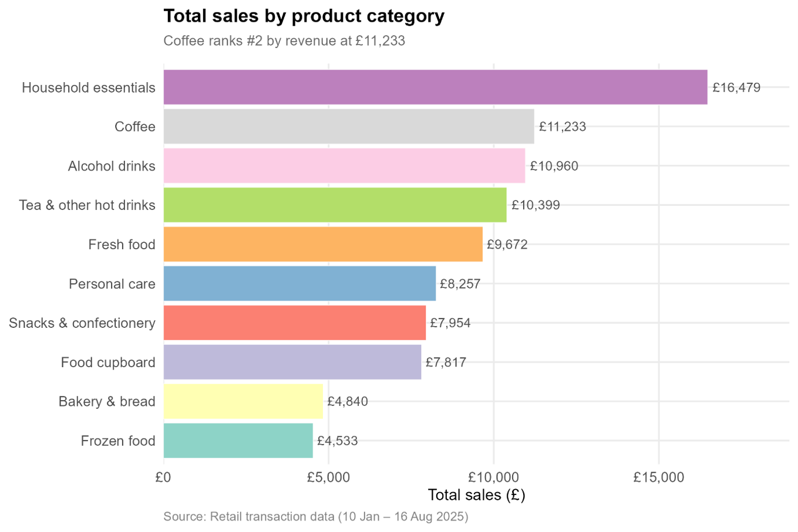
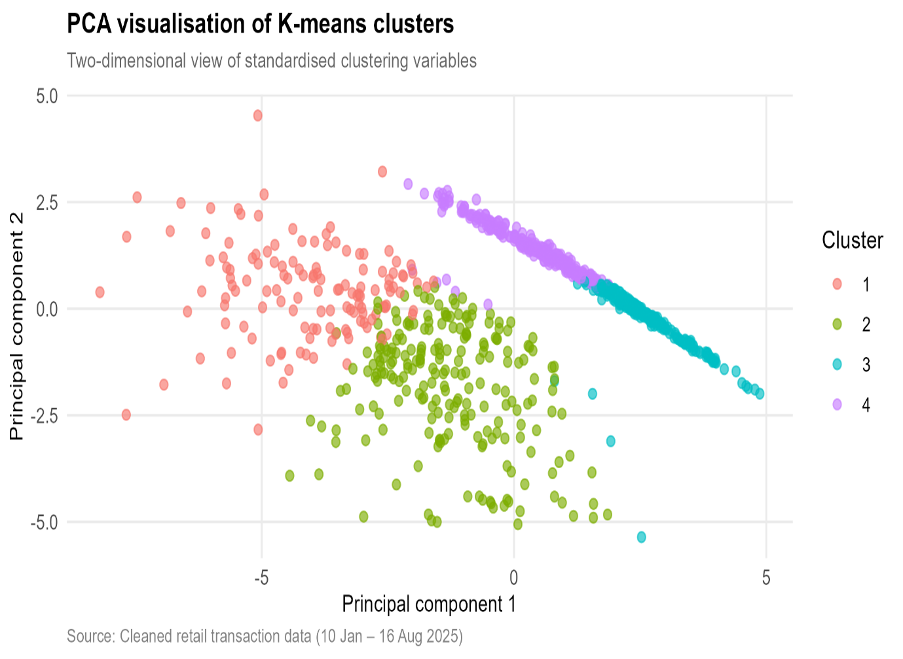
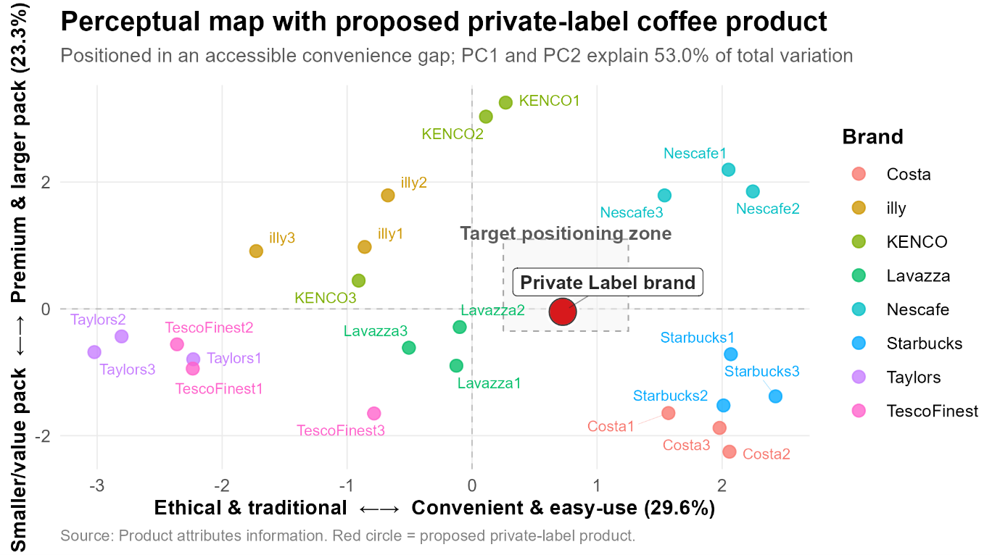
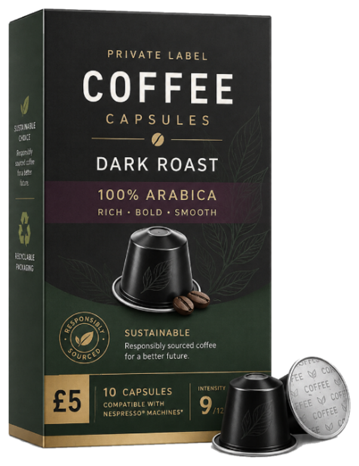

# Marketing Analytics: Private-Label Coffee Strategy

## Snapshot

**Business question:** Which private-label coffee product should a UK grocery retailer launch, and which customer segment should it target?

**Recommendation:** Launch a sustainable dark-roast 100% Arabica capsule coffee product priced at £5.

**Target segment:** High-value coffee loyalists

**Tools:** R, Power BI, Excel

**Methods:** Customer segmentation, RFM analysis, K-means clustering, conjoint analysis, PCA positioning, Power BI dashboarding, 4P marketing strategy

**Output:** Portfolio case study report, R analysis code, Power BI dashboard, product strategy visuals

---

## Why This Project Matters

A UK grocery retailer planning a new private-label coffee product needs more than a product idea. It needs evidence around customer demand, target segment fit, product attributes, price positioning, and competitor differentiation.

This project uses marketing analytics to move from customer and market data to a practical product launch recommendation. The aim was to identify a commercially attractive target segment, design a data-supported coffee product, and translate the analysis into a clear 4P marketing strategy.

---

## What I Did

* Analysed cleaned retail transaction data to understand customer value, purchase behaviour, and coffee category relevance.
* Used RFM analysis and K-means clustering to identify customer segments.
* Selected **High-value coffee loyalists** as the primary target segment based on value, frequency, recency, and coffee engagement.
* Applied conjoint analysis to understand which coffee attributes influenced customer preference.
* Used PCA positioning to compare the proposed product against competitor coffee products.
* Built a Power BI dashboard to communicate the evidence behind targeting, pricing, product design, and positioning.
* Developed a 4P marketing mix recommendation covering product, price, place, and promotion.

---

## Key Metrics

* **4,961** cleaned transaction rows analysed
* **922** customers profiled
* **£92,142.73** total cleaned sales analysed
* **£11,233** coffee category sales
* **39.4%** overall coffee buyer rate
* **98.5%** coffee buyer rate in the target segment
* **£297** average customer value in the target segment
* **44.5%** conjoint importance for product format
* **31.1%** conjoint importance for price
* **32.0%** predicted market share for the proposed product concept

---

## Final Product Recommendation

The recommended product is a:

**Sustainable dark-roast 100% Arabica capsule coffee product priced at £5.**

This concept was selected because it balances:

* **Convenience** through capsule format
* **Quality perception** through dark roast and 100% Arabica
* **Ethical appeal** through sustainability positioning
* **Private-label value** through accessible premium pricing
* **Competitive differentiation** through a positioning gap between mass convenience brands and traditional ethical products

---

## Business Problem

Private-label products are no longer only low-cost alternatives. Grocery retailers increasingly use private-label ranges to compete through quality, differentiation, sustainability, and value.

The challenge in this project was to decide:

**Which customer segment should be prioritised, what coffee product should be launched, and how should it be positioned against branded competitors?**

A single undifferentiated coffee product risks weak appeal across the market. The analysis therefore focused on identifying a high-value target segment and designing a product concept supported by customer and market evidence.

---

## Analytical Approach

The project followed a business analytics workflow:

1. **Data preparation**

   * Cleaned retail transaction data
   * Removed duplicates and incomplete product category records
   * Created customer-level variables such as recency, frequency, monetary value, coffee spend, and coffee buyer status
   * Reviewed outliers and removed one extreme coffee transaction after influence testing

2. **Customer segmentation**

   * Applied RFM analysis to identify high-value and coffee-relevant customers
   * Used hierarchical clustering and K-means clustering to identify behavioural customer segments
   * Used ANOVA to test cluster separation
   * Used LDA to test whether prospects could be classified from demographic data

3. **Product design**

   * Used conjoint analysis to estimate product attribute preferences
   * Evaluated format, price, strength, origin, and sustainability
   * Estimated willingness-to-pay for key attributes

4. **Market positioning**

   * Used PCA to map competitor coffee products
   * Projected the proposed private-label product into the competitive space
   * Identified a positioning opportunity for an accessible premium capsule product

5. **Dashboarding and strategy**

   * Built a Power BI dashboard to summarise product, price, place, and promotion evidence
   * Translated analytical outputs into a 4P marketing mix recommendation

---

## Key Findings

### 1. Coffee is a strategically attractive category

Coffee ranked **#2 by revenue** in the cleaned transaction data, generating **£11,233** in sales. This supported the business case for a private-label coffee launch.

### 2. The best target segment is High-value coffee loyalists

The strongest launch opportunity was the **High-value coffee loyalists** segment. This segment had:

* **135 customers**
* **14.6%** of the customer base
* **£297** average customer value
* **8.92** average purchase frequency
* **26.1 days** average recency
* **98.5%** coffee buyer rate
* **£42.20** average coffee spend

This segment combines high grocery value with strong coffee-category engagement.

### 3. Behavioural targeting is stronger than demographic targeting

ANOVA showed that behavioural variables such as frequency, monetary value, coffee share, category diversity, and product diversity separated the clusters strongly. Demographic variables such as age, income, and household size were not significant separators.

This means the product should be targeted using behavioural data such as loyalty-card activity, coffee purchase history, and transaction patterns rather than broad demographic assumptions.

### 4. Product format is the strongest choice driver

Conjoint analysis showed that **format** was the most important attribute, accounting for **44.5%** of preference variation. Price was second at **31.1%**.

Capsule format had the strongest positive utility, supporting a capsule-led product launch.

### 5. The proposed product has strong simulated market appeal

The proposed product achieved a predicted market share of **32.0%** against three competitor profiles, making it the highest-ranked option in the simulation.

The proposed product was:

**Capsule | £5 | Dark roast | 100% Arabica blend | Sustainability claim**

### 6. PCA showed a clear positioning opportunity

The PCA perceptual map showed a gap between mass convenience brands and more traditional ethical products. The proposed private-label product occupies an accessible convenience position while still carrying premium and sustainability cues.

---

## Analytical Outcomes and Decision Value

This project translated marketing analytics into a practical product launch decision.

The analysis helped to:

* Identify a commercially attractive coffee customer segment
* Understand which product attributes mattered most to customers
* Justify the £5 price point using conjoint and competitor evidence
* Position the product against branded competitors
* Use dashboarding to communicate insights to stakeholders
* Build a full 4P strategy supported by data

The decision value is not only the final product concept. The project demonstrates how customer segmentation, product preference modelling, positioning analysis, and dashboarding can work together to support retail product strategy.

---

## Business Recommendations

### 1. Launch a sustainable dark-roast 100% Arabica capsule coffee product

The proposed product combines the strongest product design signals from the analysis: capsule convenience, dark roast strength, Arabica quality, sustainability, and accessible premium pricing.

### 2. Target High-value coffee loyalists first

This segment has the strongest combination of customer value and coffee-category engagement. The high coffee buyer rate and average customer value make it the most commercially attractive launch audience.

### 3. Use behavioural targeting rather than demographic targeting

The weak LDA performance showed that demographics alone cannot reliably identify the best target customers. The retailer should use loyalty-card data, coffee purchase history, basket behaviour, and transaction-based personalisation.

### 4. Position the product as accessible premium

The £5 price point supports a premium private-label position without moving into the highest branded price tier. The product should be positioned as better quality than basic own-label coffee while still offering stronger value than premium brands.

### 5. Promote convenience, quality, and sustainability

Promotional messaging should focus on capsule convenience, dark roast flavour, 100% Arabica quality, sustainable credentials, and everyday value. Heavy discounting should be avoided because it could weaken the accessible premium position.

---

## Key Visuals

### Category Sales Context



**Business takeaway:** Coffee ranked as a high-value product category, supporting its attractiveness for private-label product development.

### Customer Segmentation



**Business takeaway:** Segmentation identified distinct customer groups and supported the selection of High-value coffee loyalists as the priority target segment.

### Conjoint Analysis


**Business takeaway:** Conjoint results showed that format and price were the strongest product choice drivers, supporting a capsule-based coffee concept at the selected price point.

### Perceptual Map



**Business takeaway:** The proposed product occupies an accessible convenience gap, balancing premium cues with private-label value.

### Power BI Dashboard


**Business takeaway:** The dashboard combines targeting, product design, pricing, and positioning evidence into one decision-making view.

### Final Product Concept



**Business takeaway:** The final recommended concept is a sustainable dark-roast 100% Arabica capsule coffee product priced at £5.

---

## Report

The full portfolio case study report is available in the `report/` folder:

[View Portfolio Case Study Report](report/Marketing-Analytics-Coffee-Strategy-Portfolio-Case-Study.docx)

---

## Repository Structure

```text
code/        R scripts and analysis files
dashboard/   Power BI dashboard file and dashboard screenshots
visuals/     Key charts, screenshots, and product visuals
report/      Portfolio case study report
data/        Data notes or sample data information
```

---

## Project Status

Completed as part of my MSc Business Analytics portfolio.


