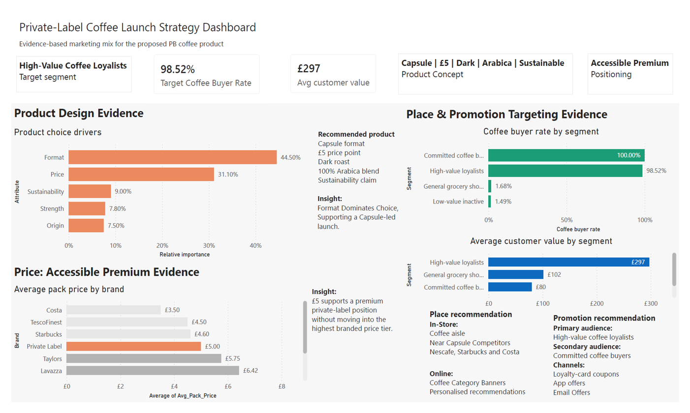
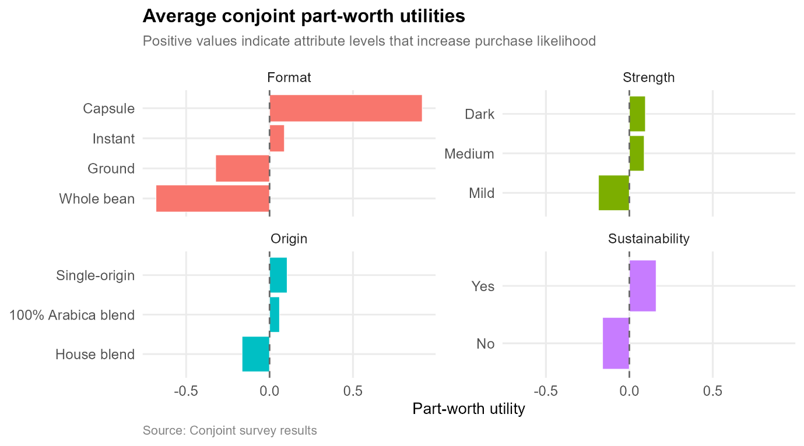

# Marketing Analytics: Private-Label Coffee Strategy

## Project Overview

This project uses marketing analytics to design and justify a new private-label coffee product for a UK-based grocery retailer. The analysis combines customer segmentation, product preference modelling, brand positioning, and dashboarding to recommend a targeted coffee product concept and marketing strategy.

The final recommendation is a **sustainable dark-roast 100% Arabica capsule coffee product priced at £5**, supported by customer data, market positioning analysis, and Power BI dashboard insights.

## Business Problem

A UK grocery retailer wants to launch a new private-label coffee product. The challenge is to identify an attractive customer segment, understand customer preferences, position the new product against competitors, and design a coherent marketing mix.

The project addresses the following business question:

**Which customer segment and coffee product concept should the retailer target to maximise strategic fit and customer appeal?**

## Project Highlights

* Analysed customer purchasing behaviour to identify attractive customer segments.
* Used segmentation methods to support target customer selection.
* Applied conjoint analysis to evaluate product attribute preferences.
* Used PCA positioning to compare the proposed product against competing coffee products.
* Built a Power BI dashboard to communicate target segment, pricing, product format, and positioning evidence.
* Developed a full 4P marketing mix strategy covering product, price, place, and promotion.

## Objectives

* Identify a valuable target customer segment using customer and transaction data.
* Analyse coffee product preferences and key product attributes.
* Design a private-label coffee concept aligned with customer needs.
* Compare product positioning against competitors.
* Build a dashboard to support marketing decisions.
* Translate analytical findings into a practical 4P marketing strategy.

## Tools, Methods, and Analytical Approach

* **R:** data preparation, segmentation analysis, conjoint analysis, PCA, and visualisation.
* **Power BI:** dashboard design, KPI cards, slicers, and business storytelling.
* **Excel:** data review, validation, and supporting analysis.
* **Customer segmentation:** identification of attractive target customer groups.
* **Conjoint analysis:** evaluation of product attribute preferences.
* **PCA positioning:** comparison of product positioning against competitors.
* **Marketing mix analysis:** development of product, price, place, and promotion strategy.

## Key Findings

* A focused customer segment showed stronger suitability for a premium but accessible private-label coffee offer.
* Capsule format was selected because it aligned with convenience-led coffee consumption and clear product differentiation.
* Dark roast 100% Arabica was selected to support a premium quality perception.
* Sustainability was included as a product attribute to strengthen brand positioning and appeal to conscious consumers.
* The £5 price point was selected to balance premium positioning with private-label value expectations.
* Power BI dashboard visuals supported the final product, pricing, and targeting decisions.

## Analytical Outcomes and Decision Value

* Translated customer and market data into a clear private-label product recommendation.
* Connected segmentation, conjoint analysis, and positioning outputs to practical marketing decisions.
* Used dashboarding to communicate evidence behind the target segment, product format, pricing, and positioning.
* Developed a coherent marketing strategy that links data analysis with business action.
* Demonstrated how analytics can support product development and retail marketing decision-making.

## Business Recommendations

* **Launch a sustainable dark-roast 100% Arabica capsule coffee product.**
  This concept combines quality, convenience, and sustainability while remaining suitable for a private-label retail strategy.

* **Target customers who value convenience, quality, and ethical product cues.**
  The product should be positioned toward shoppers who are open to premium-style coffee but still expect strong value from a grocery retailer’s private-label range.

* **Use a £5 price point to balance premium perception and accessibility.**
  The price supports quality positioning while remaining competitive within the private-label category.

* **Promote the product around quality, sustainability, and everyday convenience.**
  Messaging should focus on dark roast flavour, 100% Arabica quality, sustainable credentials, and capsule convenience.

* **Use dashboard insights to support ongoing product and campaign decisions.**
  The dashboard can help communicate the customer rationale, product positioning, and pricing logic to marketing stakeholders.

## Key Visuals

Add project visuals here after uploading screenshots to the `visuals/` folder.

Example:

```markdown



```

## Report

The full business report is available in the `report/` folder:

[View Full Report](report/Marketing-Analytics-Coffee-Business-Report.pdf)

## Repository Structure

```text
code/       R scripts and analysis files
dashboard/  Power BI dashboard file or screenshots
visuals/    Key charts, screenshots, and outputs
report/     Final business report
data/       Data notes or sample data information
```

## Project Status

Completed as part of my MSc Business Analytics portfolio.
